# **Full-Stack MERN Social Learning Platform**  
### **Posts • Code Editor • Followers • Profile • Cloudinary • Auth • Charts Analytics**


##  Screenshots

Below are the UI screenshots of the Stock Market Trading Platform:

<p align="center">
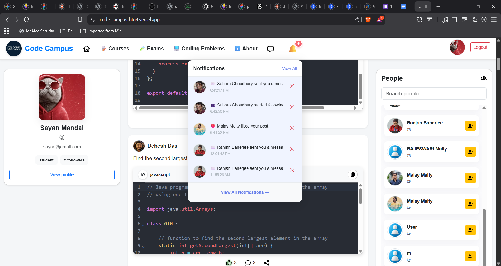</p>

<p align="center">
  
</p>

<p align="center">
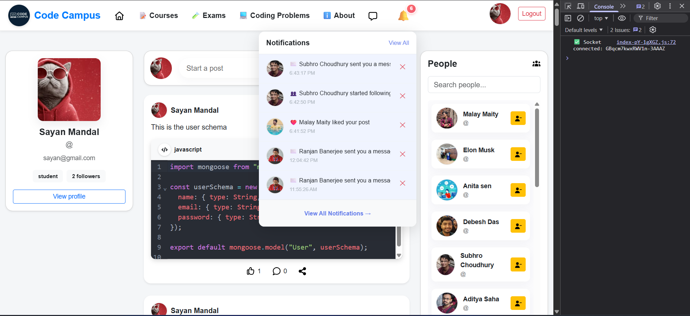</p>

<p align="center">
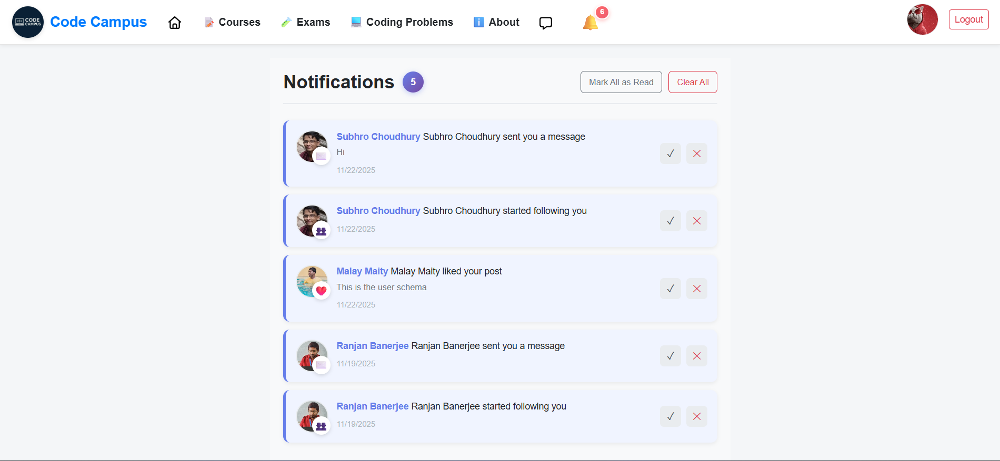</p>

<p align="center">
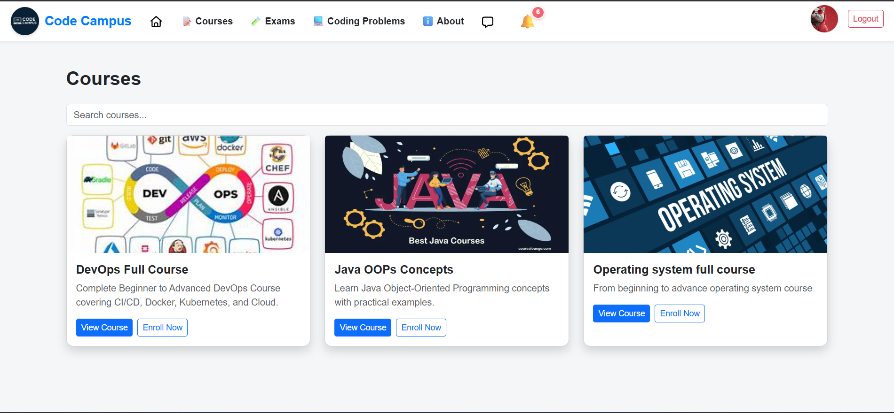</p>


<p align="center">
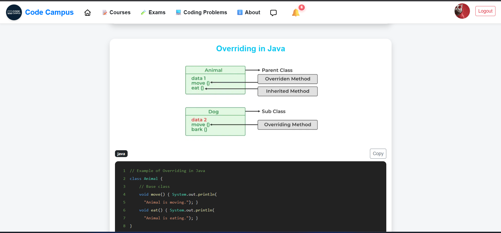</p>


<p align="center">
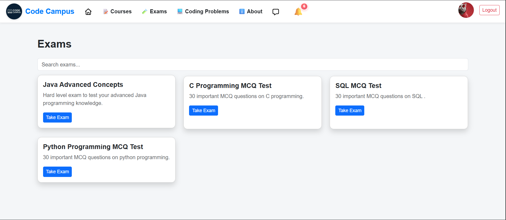</p>

<p align="center">
  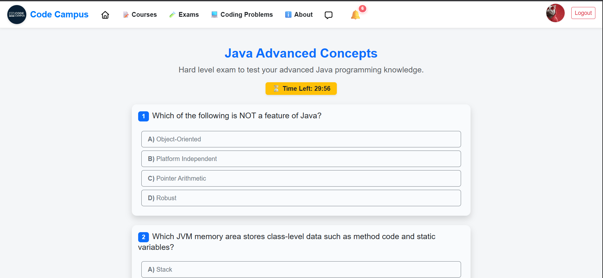
</p>

<p align="center">
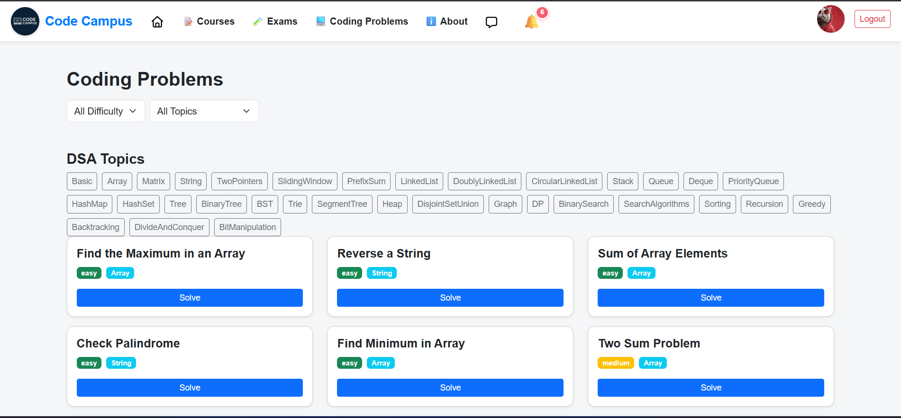</p>

<p align="center">
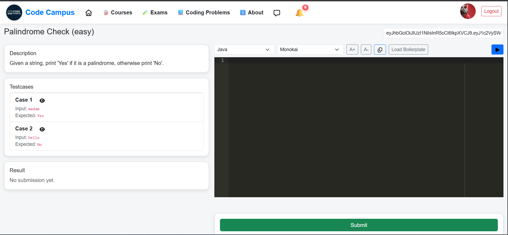</p>

<p align="center">
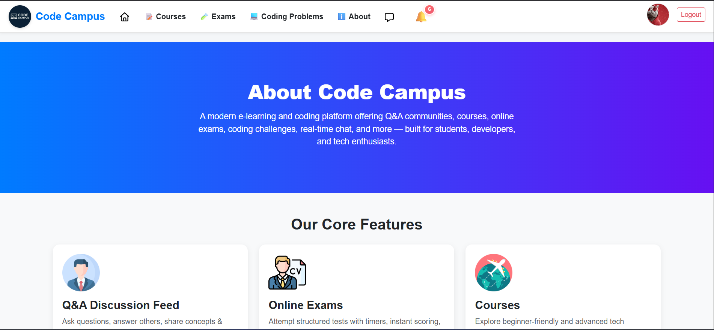</p>


<p align="center">
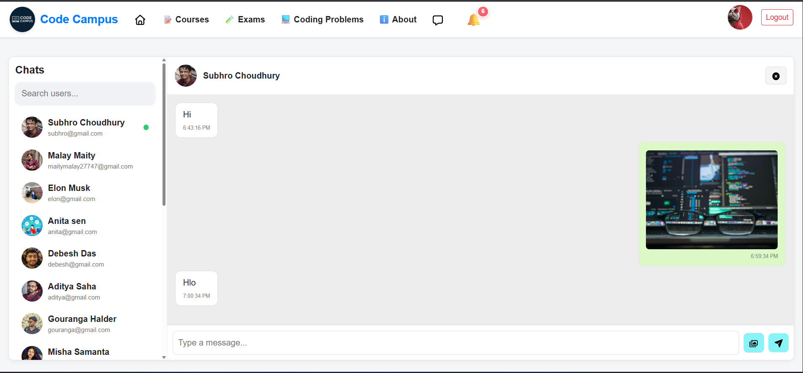</p>

<p align="center">
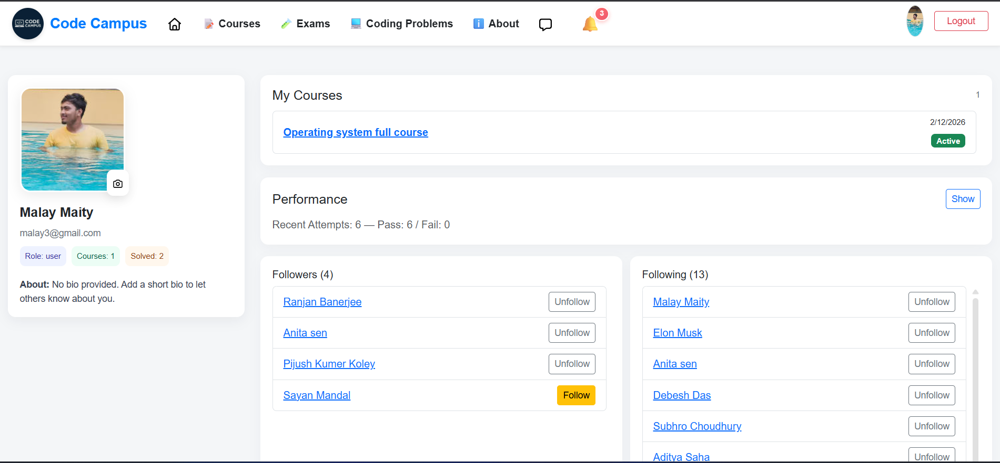</p>

<p align="center">
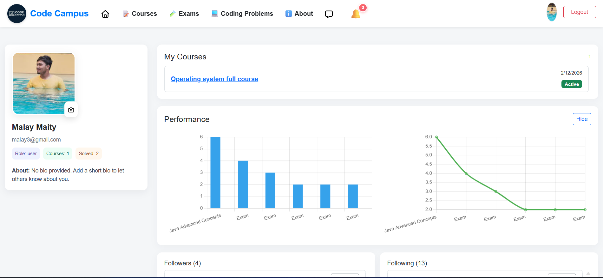</p>

<p align="center">
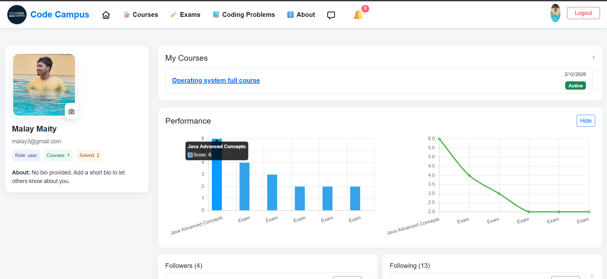</p>

<p align="center">
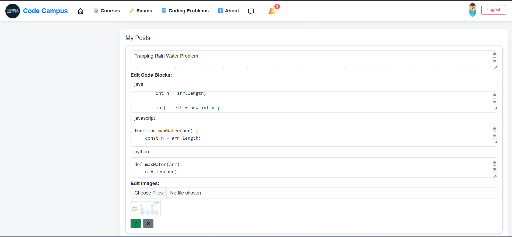</p>

<p align="center">
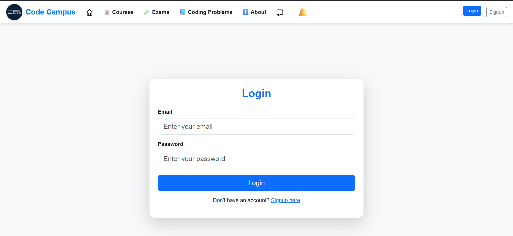</p>

<p align="center">
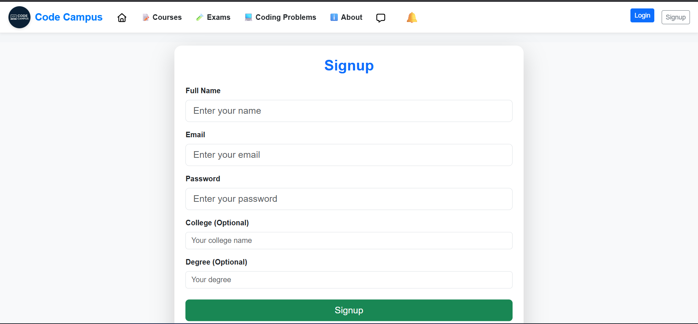</p>


A full-stack MERN application that provides:

✅ User Authentication (JWT)  
✅ Profile System + Profile Image Upload (Cloudinary)  
✅ Post Creation, Image Uploads, Code Blocks  
✅ Edit / Delete Posts  
✅ Followers / Following System  
✅ Course Enrollments & Exam Attempts  
✅ Analytics Dashboard (Charts)  
✅ Real-time functionality ready (Socket.io included)  
✅ Fully responsive frontend (React + Bootstrap + Vite)

---

## 📁 **Project Structure**

```
my-project/
│
├── backend/
│   ├── controllers/
│   ├── routes/
│   ├── models/
│   ├── middleware/
│   ├── uploads/
│   ├── .env
│   ├── package.json
│   └── index.js
│
├── frontend/
│   ├── src/
│   ├── public/
│   ├── .env
│   ├── package.json
│   └── vite.config.js
│
├── docker-compose.yml
├── README.md
└── .gitignore
```

---

##  **Backend Setup**

### 1. Install dependencies:
```sh
cd backend
npm install
```

### 2. Create `.env`:
```
MONGO_URL=your-mongodb-url
JWT_SECRET=your-secret-key

CLOUDINARY_CLOUD_NAME=xxxx
CLOUDINARY_API_KEY=xxxx
CLOUDINARY_API_SECRET=xxxx

PORT=5000
```

### 3. Start server:
```sh
npm start
```

---

##  **Frontend Setup**

```sh
cd frontend
npm install
npm run dev
```

Create `.env`:
```
VITE_API_URL=http://localhost:5000/api
```

---

##  **API Routes**
(Full details provided earlier)

---

##  Docker
```sh
docker-compose up --build
```

---

##  Author
Malay Maity

